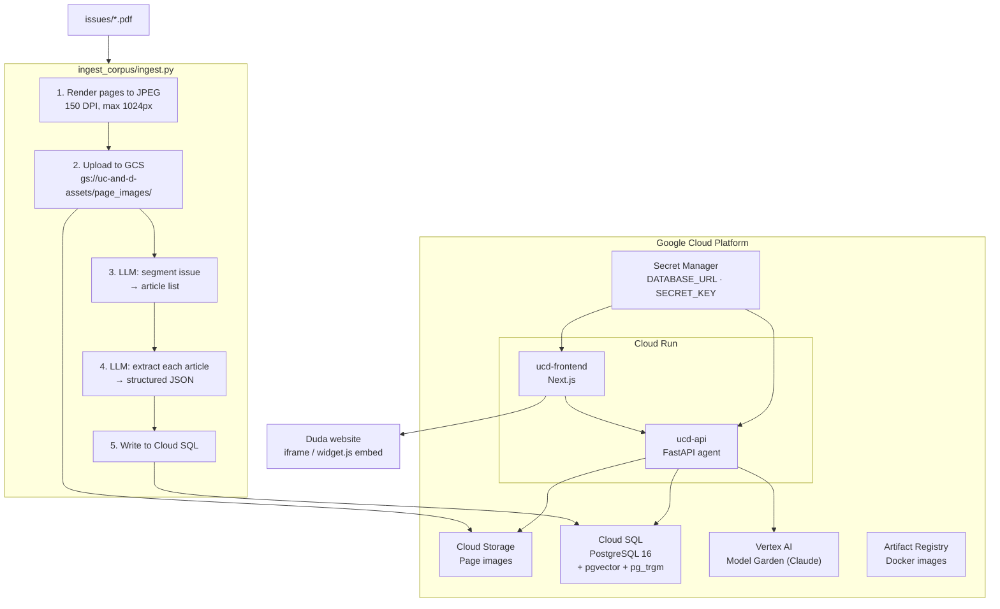
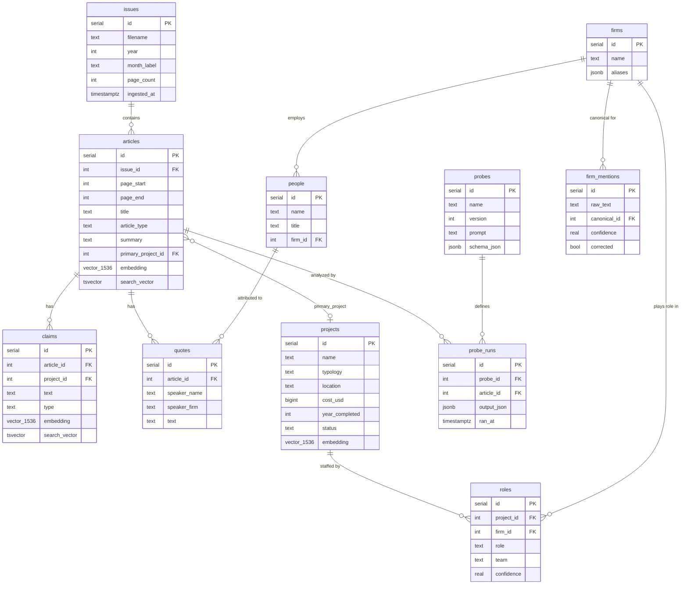

# UCD Intelligent Research Platform

A B2B research tool for *Utah Construction & Design* magazine. Ingests 100+ issues of the magazine (PDF), extracts structured project data using a multimodal LLM pipeline, and serves a conversational research interface embedded in the client's Duda website.

---

## Architecture



### GCP Services

| Service | Purpose |
|---|---|
| Cloud SQL (PostgreSQL 16) | Primary database — `ucd-db` in `us-central1` |
| Cloud Storage | Page images — `gs://uc-and-d-assets/page_images/{issue_id}/page_NNNN.jpg` |
| Cloud Run | API (`ucd-api`) and frontend (`ucd-frontend`) — scales to zero |
| Artifact Registry | Docker images — `us-central1-docker.pkg.dev/uc-and-d/ucd` |
| Secret Manager | `DATABASE_URL`, `SECRET_KEY` |
| Vertex AI Model Garden | Claude (LLM) — billing stays on the GCP project |

Infrastructure is managed with Terraform. State lives in `gs://uc-and-d-tf-state/terraform/state`.

---

## Repository Layout

```
.
├── ingest_corpus/          # UCD magazine ingestion pipeline
│   ├── ingest.py           # Primary ingestion pipeline (PDF → DB)
│   ├── download_issues.py  # Scrapes utahcdmag.com/archive to download PDFs
│   ├── extract_projects.py # Legacy text-only extractor (kept for reference)
│   ├── make_spreadsheet.py # Exports projects.xlsx from extracted/ JSONs
│   └── requirements.txt
│
├── ingest_public/          # Utah project feed scrapers (UP3, DFCM, STIP, ...)
│
├── core/                   # Shared across both ingestion tracks
│   ├── db.py               # PostgreSQL connection helpers
│   ├── resolution/         # Firm + project entity resolution
│   ├── embeddings/         # Vector column population
│   ├── probes/             # Probe registry + runner
│   └── geocode/            # Lat/lng enrichment
│
├── db/
│   ├── schema.sql          # PostgreSQL schema (source of truth)
│   └── migrations/         # Forward-only migrations
│
├── api/                    # FastAPI backend (Cloud Run)
├── frontend/               # Next.js frontend (Cloud Run)
│
├── infra/                  # Terraform
│   ├── main.tf             # Provider, backend, API enablement
│   ├── database.tf         # Cloud SQL instance, DB, user, secret
│   ├── storage.tf          # GCS bucket, Artifact Registry
│   ├── iam.tf              # Service account and roles
│   ├── services.tf         # Cloud Run services
│   ├── variables.tf
│   └── outputs.tf
│
├── tests/
│   └── test_ingestion.py   # Validates row counts and spot-checks known data
│
├── issues/                 # PDF source files (gitignored)
├── extracted/              # Per-issue JSON cache (gitignored)
├── .env.example
└── .gitignore
```

---

## Database Design

The schema (`db/schema.sql`) uses PostgreSQL 16 with the `pgvector` and `pg_trgm` extensions.

### Entity–Relationship Overview



### Tables

#### Source material

**`issues`** — one row per PDF file.

| Column | Type | Notes |
|---|---|---|
| `id` | SERIAL | |
| `filename` | TEXT | unique, e.g. `UC-D+February+2026-spreads.pdf` |
| `year`, `month_label` | INTEGER / TEXT | parsed from filename |
| `page_count` | INTEGER | set after GCS upload |
| `ingested_at` | TIMESTAMPTZ | |

**`articles`** — one row per article/segment within an issue.

| Column | Type | Notes |
|---|---|---|
| `id` | SERIAL | |
| `issue_id` | INTEGER | FK → issues |
| `page_start`, `page_end` | INTEGER | inclusive page range |
| `title`, `author` | TEXT | |
| `article_type` | TEXT | `project_feature \| column \| advertisement \| other` |
| `summary` | TEXT | LLM-generated |
| `primary_project_id` | INTEGER | FK → projects (deferred, NOT VALID) |
| `embedding` | vector(1536) | populated by `embed.py` |
| `search_vector` | tsvector | auto-updated by trigger |

#### Canonical entities

**`projects`** — a construction project mentioned in one or more articles.

| Column | Type | Notes |
|---|---|---|
| `id` | SERIAL | |
| `name` | TEXT | |
| `typology` | TEXT | e.g. `office`, `hospitality`, `infrastructure` |
| `location`, `city`, `state` | TEXT | |
| `cost` | TEXT | original string, e.g. `$45,900,000` |
| `cost_usd` | BIGINT | parsed integer for range queries |
| `square_footage` / `sq_ft` | TEXT / INTEGER | both forms |
| `delivery_method` | TEXT | e.g. `Design-Build`, `GC/CM` |
| `year_completed` | INTEGER | |
| `status` | TEXT | `completed \| under_construction \| announced` |
| `source_article_id` | INTEGER | FK → articles |
| `embedding` | vector(1536) | |

**`firms`** — canonical firm records (populated by `resolve.py`).

| Column | Type | Notes |
|---|---|---|
| `id` | SERIAL | |
| `name` | TEXT | unique canonical name |
| `aliases` | JSONB | array of alternate names |
| `website`, `notes` | TEXT | |

**`people`** — individuals mentioned in the magazine.

| Column | Type | Notes |
|---|---|---|
| `id` | SERIAL | |
| `name`, `title` | TEXT | |
| `firm_id` | INTEGER | FK → firms |
| `aliases` | JSONB | |

#### Relationships

**`roles`** — which firm played which role on a project.

| Column | Type | Notes |
|---|---|---|
| `id` | SERIAL | |
| `project_id` | INTEGER | FK → projects |
| `firm_id` | INTEGER | FK → firms |
| `role` | TEXT | e.g. `Architect`, `General Contractor` |
| `team` | TEXT | `design \| construction \| owner` |
| `raw_name` | TEXT | original extracted string before resolution |
| `confidence` | REAL | entity resolution confidence score |

#### Extracted content

**`claims`** — factual statements extracted from articles.

| Column | Type | Notes |
|---|---|---|
| `id` | SERIAL | |
| `article_id` | INTEGER | FK → articles |
| `project_id` | INTEGER | FK → projects (optional) |
| `text` | TEXT | the claim |
| `type` | TEXT | `stat \| milestone \| challenge \| award \| first \| other` |
| `page` | INTEGER | |
| `confidence` | REAL | |
| `embedding` | vector(1536) | for semantic search |
| `search_vector` | tsvector | for FTS |

**`quotes`** — direct quotations with speaker attribution.

| Column | Type | Notes |
|---|---|---|
| `id` | SERIAL | |
| `article_id`, `project_id` | INTEGER | FKs |
| `speaker_name`, `speaker_title`, `speaker_firm` | TEXT | as extracted |
| `speaker_person_id` | INTEGER | FK → people (after resolution) |
| `text` | TEXT | |
| `page` | INTEGER | |

#### Probe system

Probes are reusable LLM extraction templates that can be re-run over articles when requirements evolve.

**`probes`** — a versioned prompt + output schema.

**`probe_runs`** — results of running a probe against an article. Unique on `(probe_id, article_id, probe_version)`.

#### Entity resolution

**`firm_mentions`** — every raw firm name string extracted from the magazine, linked to a canonical `firms` record once resolved.

| Column | Notes |
|---|---|
| `raw_text` | e.g. `"Big-D Construction"`, `"Big D"` |
| `canonical_id` | FK → firms (null until resolved) |
| `confidence` | similarity score |
| `corrected` | manually verified flag |

### Indexes

| Index | Type | Purpose |
|---|---|---|
| `idx_articles_embedding` | ivfflat (cosine) | ANN semantic search on articles |
| `idx_projects_embedding` | ivfflat (cosine) | ANN semantic search on projects |
| `idx_claims_embedding` | ivfflat (cosine) | ANN semantic search on claims |
| `idx_articles_fts` | GIN (tsvector) | Full-text search on article titles + summaries |
| `idx_claims_fts` | GIN (tsvector) | Full-text search on claim text |
| `idx_quotes_fts` | GIN (tsvector) | Full-text search on quote text + speaker |
| `idx_firms_name_trgm` | GIN (pg_trgm) | Fuzzy firm name matching during entity resolution |
| `idx_firm_mentions_trgm` | GIN (pg_trgm) | Fuzzy raw mention matching |

`search_vector` columns are maintained automatically by `BEFORE INSERT OR UPDATE` triggers.

---

## Local Development

### Prerequisites

- Python 3.12+, `poppler` (`brew install poppler`), `psql`
- [Cloud SQL Auth Proxy](https://cloud.google.com/sql/docs/postgres/sql-proxy)
- `gcloud auth application-default login`

### Setup

```bash
python -m venv ~/environments/ucd-platform
source ~/environments/ucd-platform/bin/activate
pip install -r ingest_corpus/requirements.txt

cp .env.example .env
# fill in DATABASE_URL, ANTHROPIC_API_KEY or VERTEXAI_* vars
```

### Connect to Cloud SQL locally

```bash
cloud-sql-proxy uc-and-d:us-central1:ucd-db --port 5433 &
psql -h 127.0.0.1 -p 5433 -U ucd_user -d ucd_db
```

### Run the ingestion pipeline

```bash
cd ingest_corpus

# Download all issues
python download_issues.py

# Validate with one issue
python ingest.py --pdfs ../issues/UC-D+February+2026-spreads.pdf --limit 1 \
  --model anthropic/claude-sonnet-4-5-20250929

# Full corpus
python ingest.py --issues_dir ../issues/ \
  --model vertex_ai/claude-sonnet-4-5@20250929
```

`--reprocess` re-ingests an issue even if already in the database. Without it, already-ingested issues are skipped (safe to re-run).

### Run tests

```bash
pytest tests/test_ingestion.py
```

---

## Infrastructure

```bash
cd infra
cp terraform.tfvars.example terraform.tfvars
# fill in secret_key

terraform init
terraform plan
terraform apply
```

After first Docker build+push, set `api_image` and `frontend_image` in `terraform.tfvars` and re-apply.

### Deployed URLs

| Service | URL |
|---|---|
| API | https://ucd-api-sekbs73mtq-uc.a.run.app |
| Frontend | https://ucd-frontend-sekbs73mtq-uc.a.run.app |

---

## LLM Cost Estimate (full corpus)

104 issues · 4,291 pages · model: `claude-sonnet-4-5` ($3/1M input, $15/1M output)

| Pass | Input | Output | Cost |
|---|---|---|---|
| Segmentation (all pages) | ~6.4M tokens | ~860K tokens | ~$32 |
| Extraction (~35% of pages) | ~4.5M tokens | ~1.2M tokens | ~$32 |
| **Total** | | | **~$64** |
