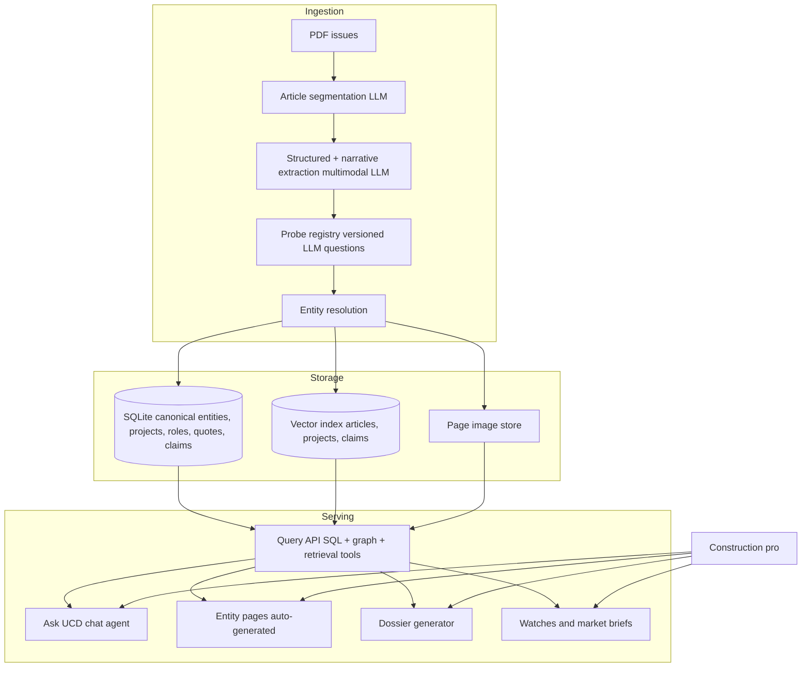

# UCD Intelligent Research Platform

## 1. Product vision, in one line

A paid research tool where a construction professional types a question in plain English — "who's been doing mass timber in the Mountain West and who's on their teams?" — and gets a synthesized, cited answer backed by every UCD article ever published, with clickable firm / project / person pages behind every claim.

The "aha" is not better filters. It's that the system **reads the articles the way a junior analyst would**, remembers every page, and synthesizes on demand.

## 2. Who it's for and the moment they convert

- **BD / preconstruction leads at GCs, A/Es, subs** — "Who should I be calling on this quarter? Who teamed with whom? Where am I underrepresented?"
- **Owners / developers / owner reps** — "Shortlist me a design-build team for a $40M aquatic center; show me their comparable work."
- **Marketing teams** — "Pull every quote, claim, and stat where our firm was mentioned in UCD since 2015."
- **Estimators** — "Cost range and delivery method distribution for 200–400k SF Class-A office in Utah, last 5 years."

Each of these is an expensive research task today (hours of page-flipping or LinkedIn sleuthing). The product compresses it to 30 seconds with citations.

## 3. Six headline capabilities that actually beat the status quo

These are ordered by differentiation, not build order.

### 3.1 Grounded conversational agent ("Ask UCD")

Chat UI. Every answer is a synthesis with inline citations that open the exact page image of the source article. Handles: comparisons, rankings, narratives, "what changed this year," open-ended market reads. Backed by retrieval over article / project / claim embeddings plus a project SQL tool the model can call.

### 3.2 Living entity pages (firms, projects, people, owners)

Every firm has a profile that writes itself from the corpus: typology specialization, geographic footprint, typical teaming partners, recent trend, signature projects, notable quotes by their people. Regenerates as new issues ingest. These are also the citation destinations from the chat agent — the "blue links" of the product.

### 3.3 Teaming / relationship graph

The most valuable latent signal in this corpus is *who keeps working with whom*. Model projects as hyperedges linking N firms in specific roles. Then you can answer things no current product answers: "Okland's most frequent MEP trio on healthcare vs. K-12," "architects Big-D has never teamed with," "firms that migrated from residential to healthcare in the last 3 years."

### 3.4 "Projects like this" + similarity dossiers

Paste an RFP, a competitor's press release, or a project name → system returns the N most similar projects with a generated explanation of *why* they're similar (typology, scale, owner archetype, delivery method, challenges), plus the teams on each. This replaces the "show me comps" task.

### 3.5 Pre-bid / pursuit dossiers

User describes a pursuit ("$80M DB lab renovation for a public university in Utah") → one-click dossier: likely competitors based on historical teaming and typology, probable teaming combinations, comparable past projects with outcomes, owner's delivery-method history, suggested differentiators drawn from quoted claims. Exportable as PDF/Excel.

### 3.6 Standing watches & market reads

Natural-language saved queries. "Email me when any new school project over $30M in Salt Lake or Davis County appears." Plus scheduled, auto-generated market briefs: "Q3 Utah commercial read — mass timber mentions up, self-storage cooling, new entrants." Delivered by email; each claim cites articles.

## 4. Why this is possible now

Two capability shifts make this viable that weren't 18 months ago:

- **Vision-LLM ingestion at reasonable cost** — we don't need `pdfplumber` heuristics anymore; we can hand whole pages (text + image) to a multimodal model and get back structured data plus every narrative claim, once, cached forever.
- **Entity resolution with LLMs** — the messy alias problem ("Big-D", "Big D Construction", "Big-D Construction Corp") is now a 10-line prompt with near-human accuracy, which is the unlock for the graph.

## 5. Architecture sketch

Key design choices:

- **Article, not page, is the unit.** A segmentation pass groups consecutive pages into "article about project X." Everything downstream keys off `article_id`.
- **Extraction splits into three outputs per article:**
  1. *Structured fields* (the current info-box stuff) — deterministic schema.
  2. *Narrative claims* — free-form "this was the first X in Utah," "completed 3 months early," each with a page-image anchor and confidence.
  3. *Quotes* — attributed pull quotes + speaker.
- **Probe registry.** A probe = `(id, version, prompt, schema)`. Add a new probe ("does this project use mass timber?") and it runs across the whole corpus at cheap-model prices, results cached by `(article_hash, probe_version)`. This is how the schema stays cheap to evolve.
- **Entity resolution as a first-class pass** with canonical records for firms, people, owners, locations, typologies. Every mention stores `(raw_text, canonical_id, confidence)`; humans can correct, and corrections retrain the resolver.
- **Storage:** SQLite (or DuckDB) for canonical relational data; a local vector store (LanceDB / sqlite-vec) alongside; page images on disk or S3. All three are local-first so the whole corpus is a single portable artifact.
- **Agent tools.** The chat agent gets four tools: `sql_query(projects/firms/roles)`, `graph_query(teaming)`, `semantic_search(corpus)`, `get_page_image(article, page)`. Answers always cite `article_id` + page range, which the UI turns into clickable page-image previews.

## 6. Data model (conceptual)

- `issues` — month, year, PDF ref, page count.
- `articles` — issue, page range, title, author, primary_project_id, embedding.
- `projects` — canonical project (name, typology, location, geocode, cost, SF, dates, delivery method, completion year, status).
- `firms` / `people` / `owners` / `developers` — canonical entities with alias arrays and embeddings.
- `roles` — `(project_id, firm_id, role, team)` hyperedge; the graph lives here.
- `claims` — `(article_id, project_id, text, type, page, confidence)` — narrative facts.
- `quotes` — `(article_id, speaker_person_id, text, page)`.
- `probes` and `probe_runs` — versioned question outputs per article.
- `typologies` — controlled vocabulary (K-12, higher-ed, healthcare, industrial, multifamily, aviation, etc.) with LLM-classified `project_typology` links.

## 7. Staged roadmap

I'd ship the chat agent and entity pages early — they're the visible "wow" — and let the graph / dossiers / watches follow.

- **Stage 0 — Foundation (re-ingest):** article segmentation; multimodal extraction; `articles`, `projects`, `claims`, `quotes` populated for ~20 issues as pilot; entity resolution v1 for firms.
- **Stage 1 — Ask UCD v1:** chat agent with retrieval + SQL tool + page-image citations; minimal web UI. This alone is a demoable product.
- **Stage 2 — Entity pages:** auto-generated firm and project pages; each cites the claims and articles behind it; becomes the destination for chat citations.
- **Stage 3 — Graph features:** teaming graph surfaced as "frequent collaborators," "who they've never worked with," comparison views.
- **Stage 4 — Dossiers & similarity:** "projects like this," pursuit dossier export, comp-finder.
- **Stage 5 — Watches & market briefs:** saved NL queries, email digests, auto-generated quarterly market reads.

Each stage is independently valuable — Stage 1 would already beat every incumbent's search UX for this corpus.

## 8. Economics and moat

- **Unit economics:** one-time cost to ingest the full archive (~100 issues) at multimodal rates is two-figure dollars; per-new-issue ingest is pennies. Probes re-run across corpus are cheap-model-only. Per-user query cost is dominated by the chat model, easily sustainable at a mid-three-figure annual subscription.
- **Moat:** the corpus itself plus the entity graph plus the quote/claim index — none of which a competitor can reconstitute without (a) the archive and (b) the ingestion pipeline. The longer it runs, the more valuable the trend features (§3.6) become.

## 9. Open questions worth deciding before build

- Does the client want UCD-branded product, or your white-label platform that could later ingest other regional construction publications?
- Exclusivity / licensing around the archive?
- Target first-customer profile — a single large GC (design-partner model) or many small subs (SaaS)?
- Private-overlay feature (subscribers upload their own project data for the assistant to reason over) — desirable as a paid tier or a distraction for v1?

